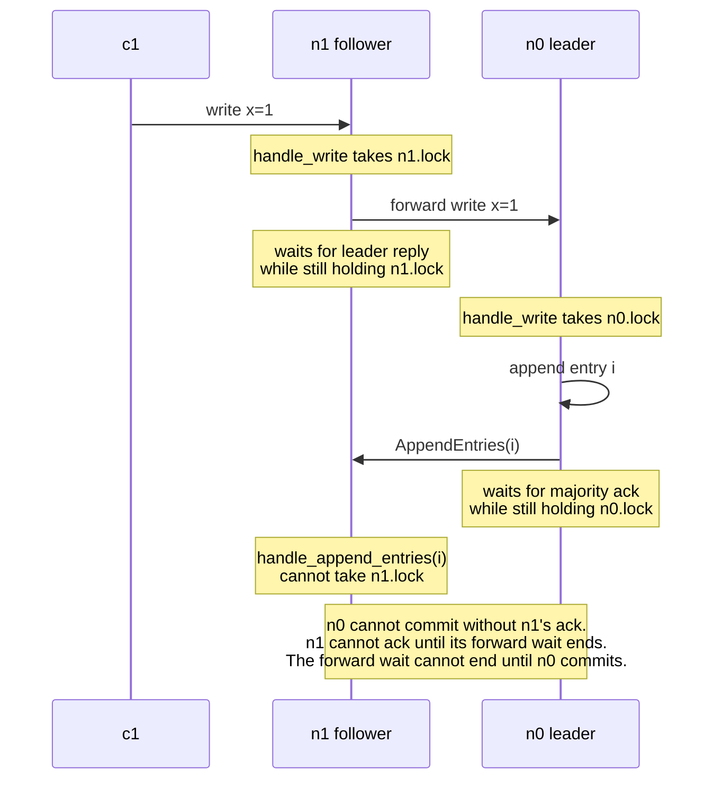
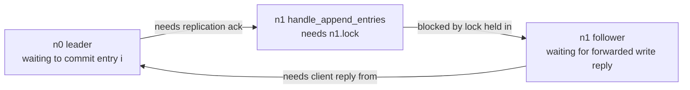
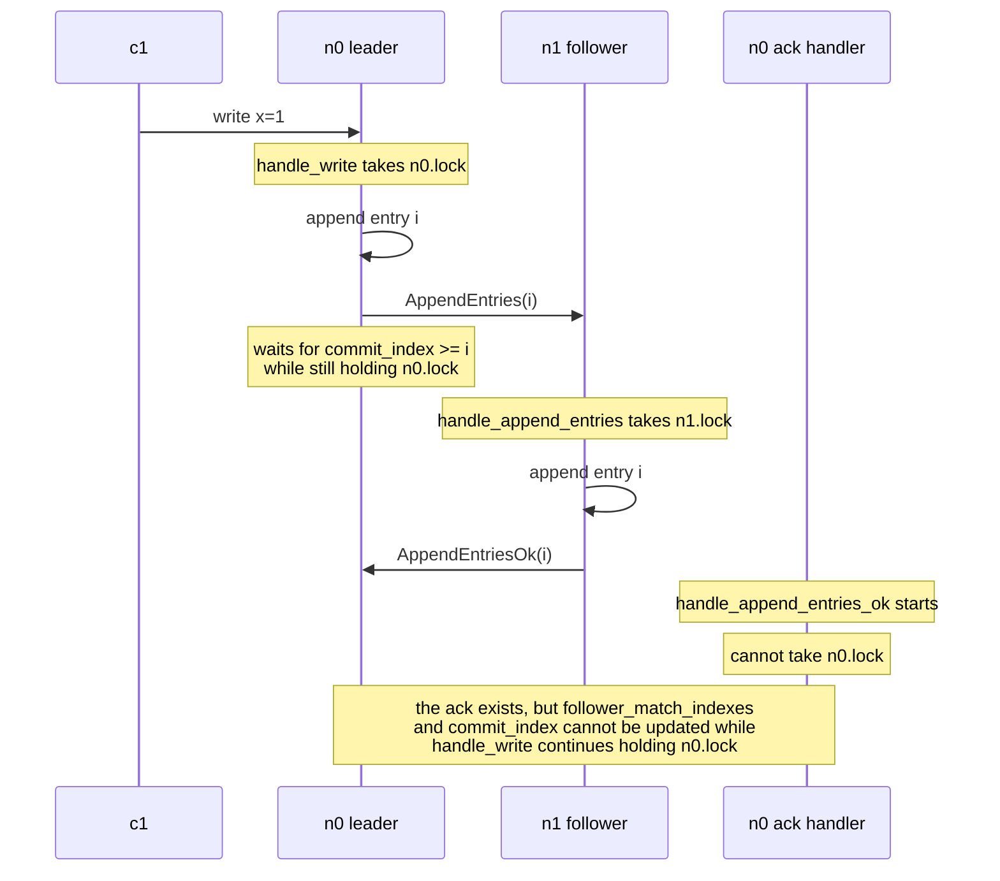
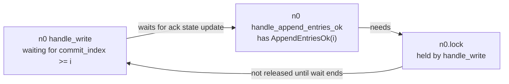

# Blocking Replication Inside Client Handlers

## Description

The bug is treating a Raft client handler as a synchronous RPC that should
return only after the operation has replicated and the client has an answer:

```python
def handle_write(message):
    with self.lock:
        if self.state == LEADER:
            index = append_to_log(message)
            send_append_entries_to_followers(index)
            wait_until_replicated(index)     # still holding self.lock
            apply_and_reply_to_client(index)
        else:
            forward_to_leader(message)
            wait_for_leader_reply(message)   # still holding self.lock
            relay_reply_to_client(message)
```

That shape is wrong for Raft. Replication is an asynchronous protocol. A
handler may append or forward, but it must not hold the node lock while waiting
for remote progress.

Blocking replication logic changes the protocol's liveness properties. It
turns "wait until any majority has the entry" into "park a handler and hope all
other handlers needed by that wait can still run." In this implementation,
every Raft handler starts by taking the same node lock, so those other handlers
often cannot run.

The canonical v0 shape separates the concerns:

- `handle_write`, `handle_read`, and `handle_cas` append or forward and then
  return.
- The replication loop sends `AppendEntries`.
- `handle_append_entries_ok` advances follower match indexes.
- `commit_at(..., send_reply=True)` replies to the original client only when
  the committed prefix crosses the operation's log index.

## Examples

### Example 1

A two-node cluster is enough to break the blocking design. The cluster is
`n0, n1`; `n0` is leader. In a two-node cluster, majority is 2, so `n0` needs
`n1`'s ack before it can commit.

Client `c1` sends `write x=1` to follower `n1`.



The cycle is:



No third node can rescue the operation. With two nodes, the follower that is
blocked in the forward wait is the only possible ack provider. The timeout may
eventually free the threads, but the protocol has stopped making useful
progress for the duration of that timeout.

### Example 2

There is a separate failure mode where the follower is not blocked at all. The
client writes directly to the leader, the follower receives `AppendEntries`,
and the follower sends a valid `AppendEntriesOk`. The system still stalls
because the leader cannot process the ack it already received.

Again use a two-node cluster: `n0` is leader, `n1` is follower. Client `c1`
sends `write x=1` directly to `n0`.



The cycle is local to the leader:



This differs from Example 1:

- In Example 1, the follower cannot create the ack because its lock is held by
  a forwarded client request.
- In Example 2, the follower already created the ack. The leader prevents
  itself from recording it.

The observed symptom can be identical: the client waits until the replication
timeout even though the network was healthy and the follower responded quickly.

## Additional issues

Blocking replication also introduces broader operational problems:

1. **One slow follower stalls unrelated clients.** In a five-node cluster,
   commit needs three replicas, not all five. A blocking helper that waits for
   every follower makes one partitioned or slow follower impose the full
   timeout on every write, even after a majority has already acked. The symptom
   is p99 latency equal to the configured replication timeout.
2. **Heartbeats and step-down are delayed.** While a leader is stuck in a
   blocking client handler, it cannot promptly process a higher-term
   `RequestVote` or `AppendEntries`. It may continue behaving like leader for
   the timeout window, forwarding or accepting client work that should have
   been rejected after step-down.
3. **Client retries multiply the damage.** Maelstrom clients time out and retry.
   A blocked handler may later emit an error or stale success for the original
   attempt while the retry has already committed elsewhere. Even when safety is
   preserved, the implementation now needs extra duplicate-response and
   pending-request cleanup logic that the nonblocking design avoids.

## Implementaiton note

Do not wait for remote replication while holding the node lock, and do not make
client response depend on the client handler remaining alive.

The handler's job is local and short:

1. Validate the node's current role.
2. If leader, append the operation and remember the client message by log index.
3. If follower with a known leader, forward the original message and return.
4. If no leader is known, reply with `ErrorCode.TEMPORARILY_UNAVAILABLE`.

After that, progress comes from protocol messages. Replication acks update
`follower_match_indexes`; commit advancement applies the log; applying a
committed client operation sends the reply. No handler waits for another
handler that needs the same lock.

The correct mental model is event-driven state transition, not synchronous
RPC. "Reply to the client after commit" does not mean "block the client handler
until commit." It means "record enough local state that a later commit event
can produce the reply."
