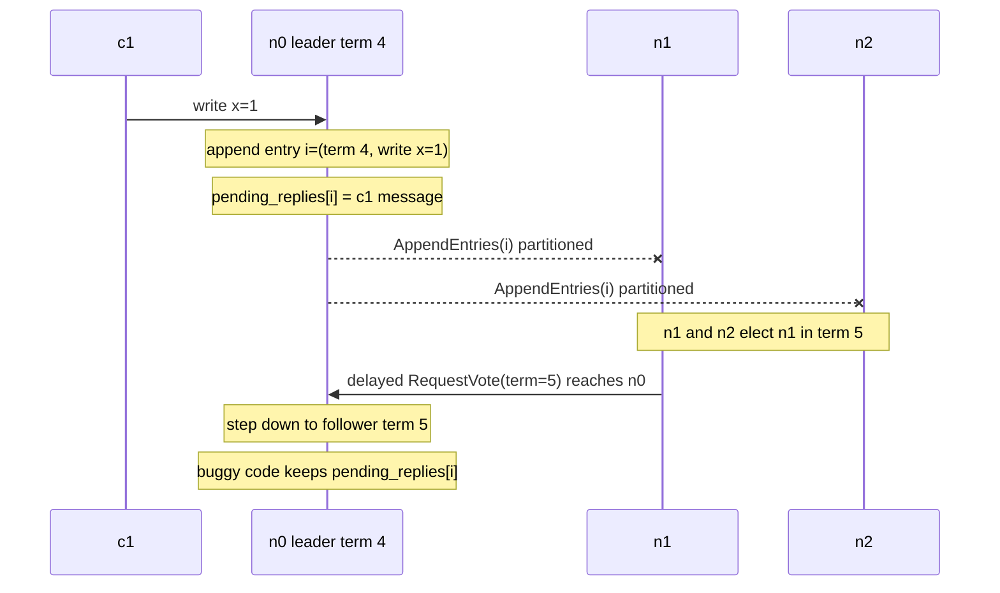
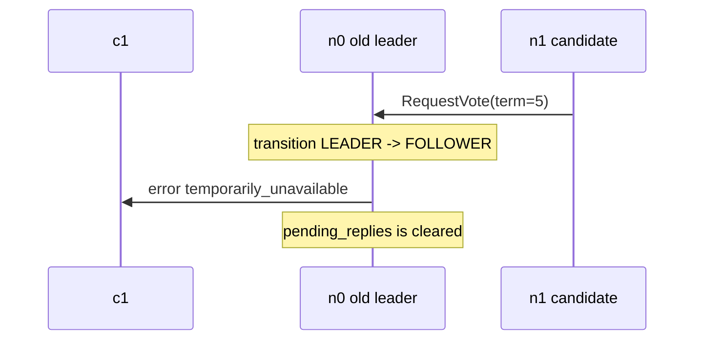
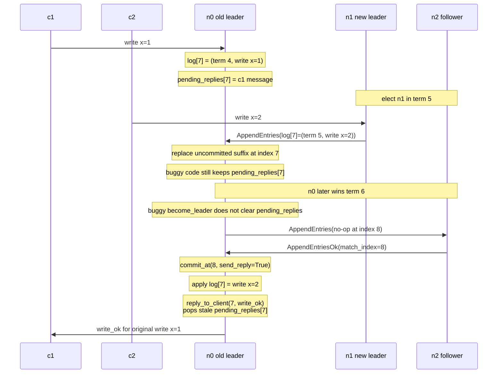
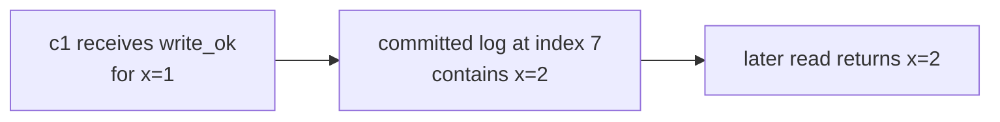

# Pending Client Replies Must Die With Leadership

## Description

The bug is letting a leader's `pending_replies` survive across leadership
epochs: the node keeps the table after it stops being leader, and does not
reset it when it later becomes leader again.

```python
def maybe_step_down(message):
    if message["body"]["term"] > self.term:
        self.state = State.FOLLOWER
        self.term = message["body"]["term"]
        self.voted_for = None
        self.leader = None
        # pending_replies is left intact
        return True
```

In v0, client operations are not answered by the client handler. A leader
appends the operation, stores the original client message in
`pending_replies[index]`, and returns. A later commit event applies the log
entry and calls `reply_to_client(index, reply_body)`.

That design is correct only while the same node is still the leader for the
term that created the pending entry. Once the node steps down, it no longer
owns those client promises. The uncommitted suffix may be overwritten by the
new leader, and the old leader may never again have a valid reason to answer
those clients.

The buggy shape treats `pending_replies` as ordinary local bookkeeping. It is
actually leader-scoped state. It must be drained or cleared on every transition
out of leadership, and a newly elected leader must start with an empty
`pending_replies` table.

## Examples

### Example 1

Three-node cluster: `n0, n1, n2`. `n0` is leader in term 4. Client `c1` sends
`write x=1` to `n0`.



Entry `i` has not reached a majority. It is not committed. After `n0` observes
term 5, it knows it is no longer the authority that can complete the original
client request.

If the pending reply is kept, `c1` receives no response from `n0`. The client
will eventually time out and retry somewhere else, but `n0` still holds the
old client message forever unless that exact index is later popped. Under
Maelstrom load, repeated leadership churn turns this into an unbounded pile of
dead pending requests.

The correct behavior is to cancel the promise when `n0` steps down:



The error does not claim the write failed forever. It says this node can no
longer finish the operation. The client may retry against the current leader.

### Example 2

The stale-pending bug becomes a safety bug if the old pending table survives
into a later leadership term.

Again use `n0, n1, n2`. `n0` is leader in term 4 and accepts `write x=1` at
log index 7, but the entry is replicated only to `n0`.



Raft permits the term 5 leader to overwrite the old leader's uncommitted
entry. The operation at index 7 is now `write x=2`, not `write x=1`.

When `n0` later becomes leader in term 6, it may commit a new-term entry at
index 8. Committing index 8 also applies the preceding uncommitted prefix,
including index 7. If `n0` kept `pending_replies[7]` for `c1`, the normal
leader commit path may pop that stale pending reply and send `write_ok` to the
wrong client for the wrong operation. The reply is keyed only by the index, but
leadership loss invalidated the meaning of that index for the old client.

The stale success can create a linearizability violation:



From the client's perspective, `write x=1` completed. From the replicated log's
perspective, that write never committed. The implementation has answered based
on stale leader-local bookkeeping rather than committed ownership of the
operation.

## Additional issues

1. **Reads and CAS requests have the same lifecycle.** v0 logs `read`, `write`,
   and `cas` operations. A pending read from a former leader can be answered at
   the wrong log position just as a pending write can.
2. **Forwarded client messages do not transfer ownership.** If a follower
   forwards a client request to a leader, the leader owns the pending reply
   only after it appends the request in its current term. The forwarding
   follower should not invent its own pending entry for that client.
3. **Client retries can produce duplicate responses.** Maelstrom clients retry
   after timeouts. If the retry commits under the new leader and the old leader
   later emits a stale response for the original attempt, the client can see
   two responses for one logical operation.
4. **Silent drops are correct but expensive.** Clearing `pending_replies`
   without sending errors preserves safety, but every affected client waits for
   a timeout. Eager cancellation gives the workload a faster path to retry.

## Implementation note

Treat `pending_replies` as part of leader state, like
`follower_next_indexes` and `follower_match_indexes`.

On every transition out of `State.LEADER`, drain the table before the node
continues as follower or candidate. For each stored client message, send
`MessageType.ERROR` with `ErrorCode.TEMPORARILY_UNAVAILABLE` and the original
`in_reply_to`. Then clear the table.

The transition points are the places that make leadership false:

1. A higher-term `RequestVote`, `AppendEntries`, or `AppendEntriesOk` causes
   `maybe_step_down` to change the node to `State.FOLLOWER`.
2. A same-term `AppendEntries` causes a candidate to recognize the elected
   leader. This normally has no leader-owned pending replies, but the cleanup
   rule is harmless and keeps the state invariant simple.
3. `trigger_election` changes a follower or candidate into `State.CANDIDATE`.
   It should also ensure no old pending replies survive into the campaign.

A newly elected leader should also initialize `pending_replies` to `{}`. It may
inherit log entries from prior terms, but it does not inherit the old leader's
client response obligations.

The mental model is: a pending client reply is a promise made by a specific
leader for a specific log entry in that leader's term. When leadership ends,
the promise ends. Future commit processing must never use an old pending table
to answer for a slot whose contents may have changed.
