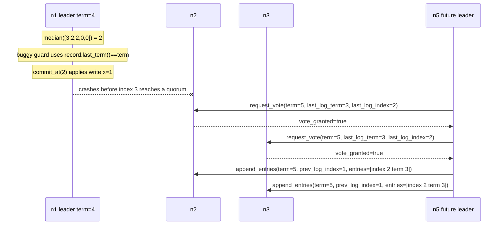

# Commit Guard Must Check The Candidate Entry Term

## Description

This bug is a one-line mistake in the leader's commit guard. In the
correct implementation, `commit_and_reply_if_applicable` computes a
candidate commit index from the leader's own `record.last_index()` plus
the follower `match_index` values reported by successful
`append_entries_ok` messages:

```python
def commit_and_reply_if_applicable(self):
    if self.state != State.LEADER:
        return
    index = median(
        [self.record.last_index(), *self.follower_match_indexes.values()]
    )
    if self.commit_index < index and self.record.at(index)["term"] == self.term:
        self.commit_at(index, send_reply=True)
```

The buggy variant checks the term of the leader's last log entry instead
of the term of the entry at the candidate commit index:

```python
if self.commit_index < index and self.record.last_term() == self.term:
    self.commit_at(index, send_reply=True)
```

`record.last_term()` answers "has this leader appended any entry in the
current term at the tail of its log?" Raft section 5.4.2 asks a narrower
question: "is the entry at this candidate commit index from the current
term?" The candidate is the `index` derived from
`follower_match_indexes`, not necessarily the leader's tail.

The two checks diverge when a leader has old, uncommitted entries below a
new current-term tail. A quorum may have replicated only the old entry.
The buggy guard treats the current-term tail as permission to directly
commit the old entry by counting replicas. That is unsafe: older entries
may only become committed transitively when a current-term entry at or
above them is committed.

## Example

Use five nodes: `n1`, `n2`, `n3`, `n4`, and `n5`. `n1` is leader in term
4. It has an old uncommitted entry at index 2 and a newer current-term
entry at index 3:

| node | log entries after committed index 1 |
| ---- | ----------------------------------- |
| `n1` | index 2 term 2: `write x=1`; index 3 term 4: `write y=1` |
| `n2` | index 2 term 2: `write x=1` |
| `n3` | index 2 term 2: `write x=1` |
| `n4` | no entry after index 1 |
| `n5` | index 2 term 3: `write x=2` |

From `n1`'s point of view, the relevant states are:

```python
n1.term = 4
n1.state = State.LEADER
n1.commit_index = 1
n1.record.last_index() == 3
n1.record.last_term() == 4
n1.record.at(2)["term"] == 2
n1.follower_match_indexes = {"n2": 2, "n3": 2, "n4": 0, "n5": 0}
```

The candidate commit index is 2:

```python
median([3, 2, 2, 0, 0]) == 2
```

The buggy guard checks the tail entry and passes:

```python
n1.record.last_term() == n1.term      # 4 == 4, true
```

So the buggy leader calls `commit_at(2, send_reply=True)`, advances
`commit_index` to 2, and applies `write x=1` to its state machine. That
is the wrong decision. The entry being directly committed is not from the
leader's current term:

```python
n1.record.at(2)["term"] == n1.term    # 2 == 4, false
```

This is not just a cosmetic rule violation. If `n1` crashes before index
3 reaches a quorum, `n5` can become leader in term 5 with its own vote
plus votes from `n2` and `n3`. `n5` can then overwrite
index 2 on those followers with its own term-3 entry. The `write x=1`
operation that `n1` applied was not guaranteed to survive a leader
change.



With the correct guard, `n1.record.at(2)["term"] == n1.term` is false,
so `n1` leaves `commit_index` at 1. If index 3 later reaches a quorum,
then the candidate index becomes 3, `record.at(3)["term"] == 4` is true,
and `commit_at(3)` safely commits both entries together.

## Additional Issues

- The direct client symptom depends on `pending_replies`. Because
  `become_leader` clears `pending_replies`, an old entry inherited across a
  leader change may be applied without a reply. That is still a safety bug:
  `commit_index` and `snapshot` moved for an entry that could later be
  overwritten.
- The bug is rare in healthy runs because a leader usually replicates a
  current-term `read`, `write`, or `cas` entry quickly. Once the median
  reaches that current-term entry, the buggy and correct guards agree.
  Partitions and leader churn stretch the window where old entries have a
  quorum but the current-term tail does not.
- The mistake is easy to mix up with the leader-election no-op issue. A
  current-term tail entry is useful for eventually committing older
  entries, but only after that current-term entry itself reaches the
  candidate commit index.
- A similar-looking misuse of `record.last_term()` in an election predicate
  would be a different bug. The commit rule is about
  `record.at(index)["term"]`; the vote up-to-date rule is about the
  candidate and receiver last log entries.

## Implementation Note

Keep the commit rule tied to the candidate index:

```python
if self.commit_index < index and self.record.at(index)["term"] == self.term:
    self.commit_at(index, send_reply=True)
```

The mental model is:

```python
median([self.record.last_index(), *self.follower_match_indexes.values()])
```

This finds the highest index known to be present on a quorum that
includes the leader. Raft 5.4.2 then adds one more requirement before
the leader may directly commit that index: the entry at that exact index
must be from `self.term`.

Older entries below it commit only as a consequence of committing the
current-term entry. They should not be individually blessed because the
leader has some later current-term entry in its log.
