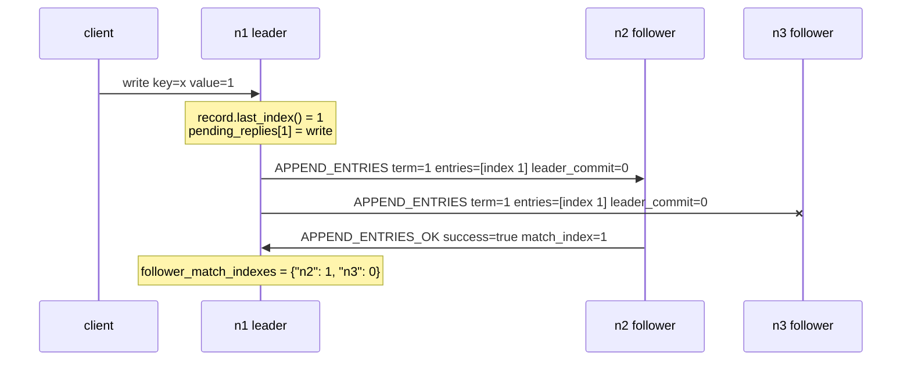

# Commit Quorum Includes The Leader

## Description

This bug is a commit-index quorum calculation that counts only followers and
forgets that the leader is also a replica.

The v0 commit path is driven by `APPEND_ENTRIES_OK` replies. When a leader
receives a successful reply in `handle_append_entries_ok`, it updates
`self.follower_match_indexes[src]` with the follower's `match_index`, updates
`self.follower_next_indexes[src]`, and then calls
`commit_and_reply_if_applicable()`.

The broken version computes the commit candidate from follower progress only:

```python
def commit_and_reply_if_applicable(self):
    if self.state != State.LEADER:
        return
    index = median(self.follower_match_indexes.values())
    if self.commit_index < index and self.record.at(index)["term"] == self.term:
        self.commit_at(index, send_reply=True)
```

That looks like a small change from the correct v0 implementation:

```python
index = median([self.record.last_index(), *self.follower_match_indexes.values()])
```

but it changes the quorum being measured. `self.follower_match_indexes` is
initialized in `become_leader()` with one entry per follower and does not contain
`self.node_id`. The leader's own log position is represented by
`self.record.last_index()`. Omitting that value turns "majority of the cluster"
into "majority of the followers".

In a three-node v0 cluster, that is enough to break availability. A majority is
two replicas. If leader `n1` and follower `n2` both have log index 1, index 1 is
replicated to a quorum even if `n3` is partitioned. The buggy calculation sees
only follower indexes `[1, 0]`; with v0's `median()` helper, that produces `0`,
so `n1.commit_index` never advances and the client never receives `write_ok`.

The correct mental translation is:

```text
commit index N when the leader plus enough followers have N
```

not:

```text
commit index N when enough followers have N
```

## Example

Three nodes are initialized as `n1`, `n2`, and `n3`. `n1` is leader in term 1.
Its leader state is:

```text
n1.state = State.LEADER
n1.term = 1
n1.commit_index = 0
n1.record.last_index() = 0
n1.follower_match_indexes = {"n2": 0, "n3": 0}
```

A client sends a `write` to `n1`. `try_persist_or_forward_entry()` appends a
term-1 entry at index 1, stores the client message in
`pending_replies[1]`, and wakes the replication loop.

Now partition `n3` away from `n1`, while `n1` can still talk to `n2`.



At this point index 1 is safely on a majority: `n1` has it in
`record.last_index()`, and `n2` has acknowledged it with `match_index=1`.

The correct v0 calculation includes the leader:

```text
median([n1.record.last_index(), n2.match_index, n3.match_index])
median([1, 1, 0]) = 1
```

Because `record.at(1)["term"] == n1.term`, `n1` calls
`commit_at(1, send_reply=True)`, applies the `write` to `snapshot`, advances
`commit_index` to 1, and sends `write_ok` to the client from
`reply_to_client(1, ...)`.

The buggy calculation excludes the leader:

```text
median([n2.match_index, n3.match_index])
median([1, 0]) = 0
```

`n1.commit_index < 0` is false, so `commit_at()` is not called. The client write
remains in `pending_replies[1]` even though a real Raft quorum has the entry.
With Maelstrom's usual three-node `lin-kv` partition test, this presents as
writes hanging or later operations being rejected with
`temporarily-unavailable` after leadership churn.

## Additional issues

- The failure also delays follower application. Followers only learn the
  leader's commit point through the `leader_commit` field on later
  `APPEND_ENTRIES` messages. If the leader's own `commit_index` is stuck at 0,
  it keeps sending `leader_commit=0`, so healthy followers that already have the
  entry do not apply it to `snapshot` either.
- The same mistake can be hidden by test topology. A two-node cluster really
  does need the one follower. A four-node cluster needs two of three followers,
  which is exactly what the follower-only median happens to demand. Testing only
  those sizes can miss the bug.
