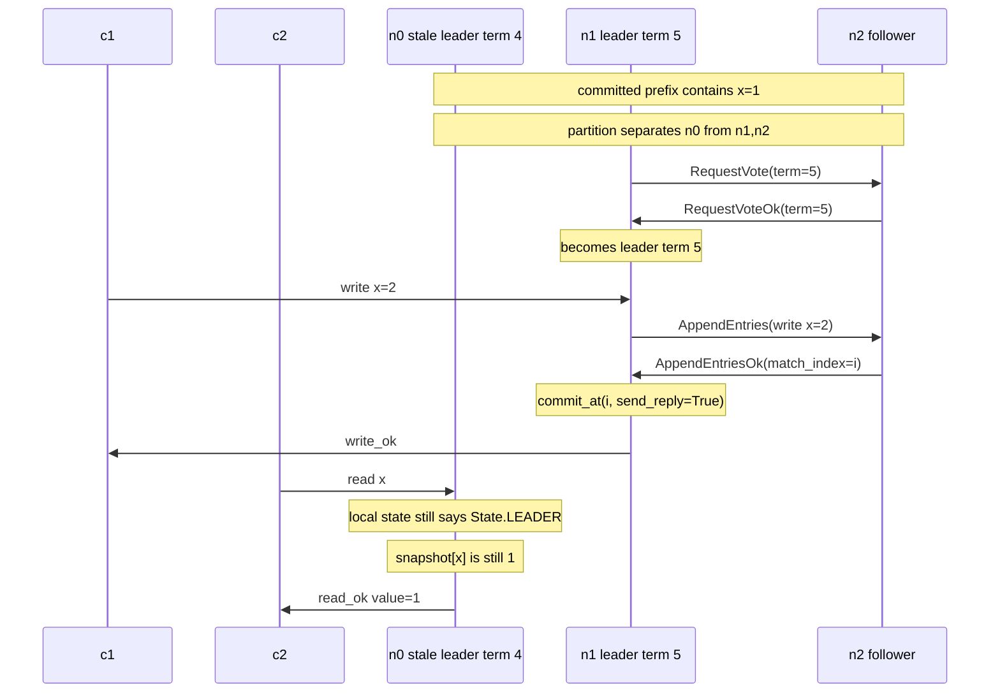
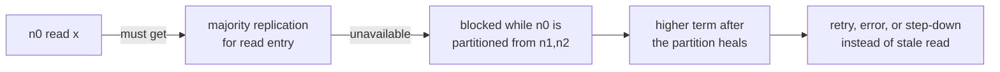
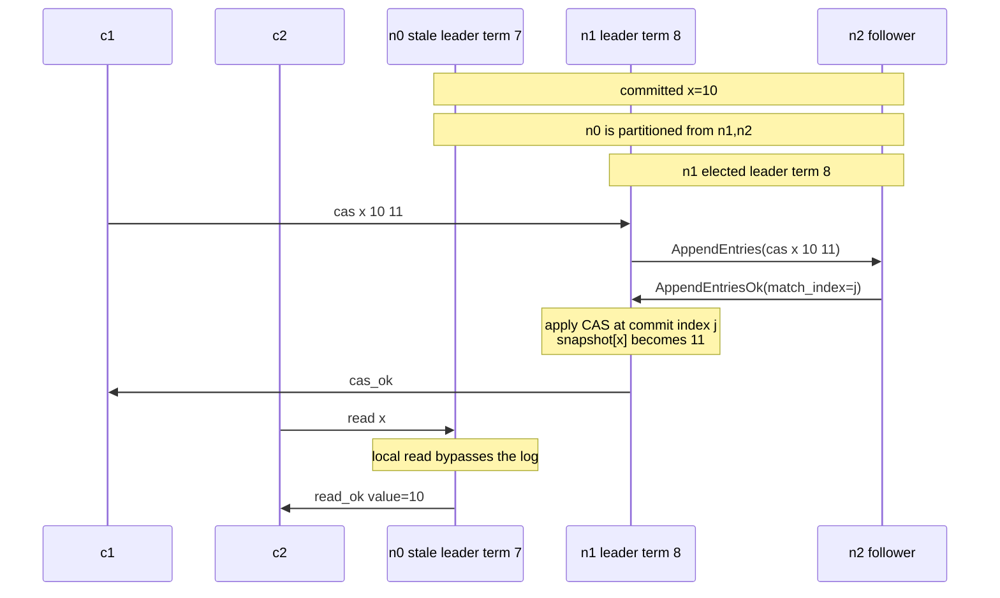
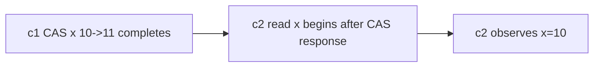

# Linearizable Reads Are Not Free

## Description

The bug is answering a client `read` directly from the leader's local state
machine:

```python
def handle_read(message):
    with self.lock:
        if self.state == State.LEADER:
            self.send(
                message["src"],
                {
                    "type": MessageType.READ_OK,
                    "in_reply_to": reply_id(message),
                    "value": self.snapshot.get(message["body"]["key"]),
                },
            )
        elif self.leader is not None:
            self.forward(self.leader, message)
```

This code looks reasonable given that `snapshot` contains only committed log entries.
However, it is not correct. A committed prefix on one node is not proof that the node is
still the current leader, and it is not proof that no newer committed operation
exists on a majority the node can no longer reach.

Raft leaders can become stale silently. If a partition isolates the old leader
from a majority, followers on the other side can elect a new leader in a higher
term and commit new client operations. Until a higher-term message reaches the
old leader, the old leader's local `state` can remain `State.LEADER`. A local
read from `snapshot` can therefore return a value that was current in an old
leadership epoch but stale in real time.

Linearizable reads need a current-leader proof. The implementation gets
that proof by logging reads like writes: `handle_read` appends a read operation
through `try_persist_or_forward_entry`, stores the client message in
`pending_replies`, replicates the entry, and replies only when the entry is
committed and applied. ReadIndex and leases are valid production alternatives,
but a bare local read is not.

## Examples

### Example 1

Three-node cluster: `n0, n1, n2`. Key `x` is already committed as `1` on all
nodes. `n0` is leader in term 4.

A partition isolates `n0` from `n1` and `n2`, but clients can still reach
`n0`. The majority side elects `n1` as leader in term 5 and commits
`write x=2`.



The write response to `c1` happens before `c2` starts the read. A linearizable
history must place `write x=2` before `read x`, so the read cannot return `1`.
The old leader's local snapshot is internally consistent, but it is not fresh.

The wait-for proof a logged read creates is exactly the missing edge:



If `n0` logs the read, it cannot commit the read entry without a majority. The
same majority that can commit new writes has moved to term 5, so `n0` either
learns about the higher term and steps down or fails to answer until the client
retries elsewhere.

### Example 2

The same bug is not limited to plain writes. Any operation that changes the
state machine and completes before the read must be visible to that read.

Start with `x=10` committed on `n0, n1, n2`; `n0` is leader in term 7. A
partition leaves `n0` alone, and `n1,n2` elect `n1` in term 8. Client `c1`
successfully performs `cas x 10 11` through `n1`. After `c1` receives
`cas_ok`, client `c2` reads from the stale leader `n0`.



The failed history is:



There is no valid linearization point for `c2`'s read. It begins after the CAS
has completed, and the CAS changed `x` from `10` to `11`. Returning `10`
pretends the read happened before a completed operation, which violates the
real-time order clients observed.

## Additional issues

1. **`commit_index` is not a freshness proof.** An old leader may have applied
   every entry through its local `commit_index` and still be missing newer
   entries committed by a later leader.
2. **Checking `self.state == State.LEADER` is not enough.** During a partition,
   a stale leader usually has not processed the higher-term `RequestVote` or
   `AppendEntries` that would make it step down.
3. **Forwarding does not fix stale leaders.** A follower that forwards reads to
   a stale `self.leader` can route clients to the exact node that must not
   answer locally.

## Implementation note

Make `read` a regular log operation:

```python
def handle_read(message):
    with self.lock:
        self.try_persist_or_forward_entry(
            {
                "term": self.term,
                "op": {"type": "read", "key": message["body"]["key"]},
            },
            message,
        )
```

The leader stores the client message in `pending_replies[index]` and returns
from the handler. Replication then follows the normal `AppendEntries` path.
When `commit_at(..., send_reply=True)` reaches the read entry, `apply` reads
the current value from `snapshot` and `reply_to_client` sends `read_ok`.

The read entry does not mutate the state machine, but it is still important:
its position in the committed log establishes that all earlier committed writes
are visible before the response. Its majority replication establishes that the
node was still able to act as leader for that log position.

The mental model is: a read is a client-visible operation with a required
linearization point. Here, that point is the commit of the read's log entry.
If you want to avoid logging reads, replace that point with an explicit
ReadIndex-style majority heartbeat protocol, not with a direct lookup in
`snapshot`.
