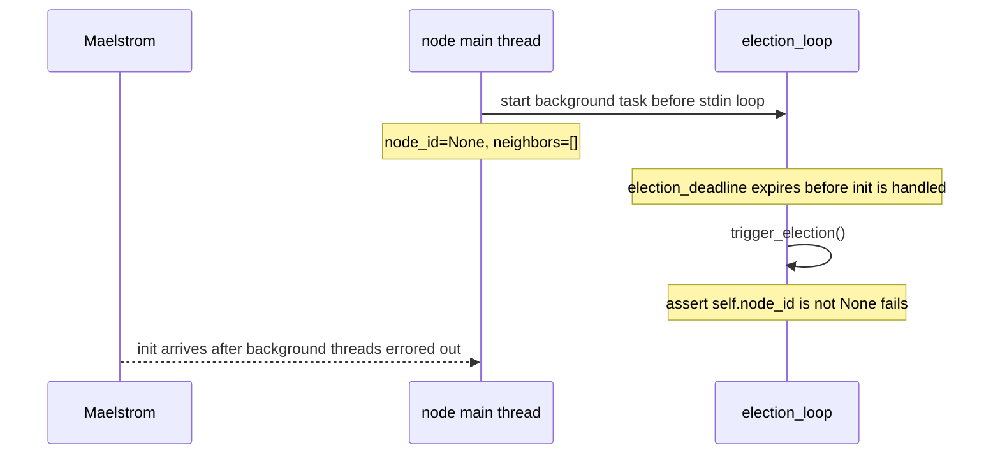

# Background Loops Before Init

## Description

The bug is registering the election and replication loops during node
construction instead of starting them after the Maelstrom `init` message has
populated `node_id` and `neighbors`.

In the correct implementation, `handle_init` initializes the identity and
membership fields, resets the election deadline, replies with `init_ok`, and
only then starts the background loops:

```python
def handle_init(self, message: Message[InitBody]):
    with self.lock:
        self.node_id = message["body"]["node_id"]
        self.neighbors = message["body"]["node_ids"]
        self.reset_deadline()
        self.send(...)
        threading.Thread(target=self.election_loop, daemon=True).start()
        threading.Thread(target=self.replication_loop, daemon=True).start()
```

The buggy variant registers those same threads in `__init__`:

```python
self.background_tasks = [
    threading.Thread(target=self.election_loop, daemon=True),
    threading.Thread(target=self.replication_loop, daemon=True),
]
```

`Node.main` starts `background_tasks` before it begins reading stdin. That means
both loops can run while `self.node_id is None` and `self.neighbors == []`.
The election loop is the dangerous one: if the first election timeout expires
before `init` is handled, it calls `trigger_election`, which asserts that
`node_id` has already been initialized.

This is a lifecycle bug, not a Raft timing feature. The election deadline
depends on initialized membership. Starting the loop before initialization gives
the scheduler a race window where that precondition is false.

## Example

Apply the patch, then run one node with `init` delayed longer than the maximum
initial election timeout:

```bash
{
  sleep 1.2
  printf '%s\n' '{"src":"c0","dest":"n0","body":{"type":"init","msg_id":1,"node_id":"n0","node_ids":["n0","n1","n2"]}}'
  sleep 0.2
} | ./main.py --version v0
```

The election timeout range is 500-1000ms, so the background election thread has
time to wake up before `init` is processed. The same race can happen less
deterministically in Maelstrom when startup is delayed by host load, CI
scheduling, a debugger, or a shortened election timeout.



The election thread raises `AssertionError` from `trigger_election` and dies.
Python prints the background-thread traceback, but the main thread can remain
alive long enough to process `init`. Since the buggy variant does not start a
replacement election loop after `init`, the node is left unable to start its own
elections. It can still answer vote requests after `init`, but it will never
become a candidate because its timer-driven election path is gone. Under
Maelstrom, that shows up as unavailable nodes and client operations timing out
rather than as a clean startup crash.

## Additional Issues

If a future refactor weakens the assertion instead of fixing the lifecycle,
the same early loop can still corrupt local state. A candidate could vote for
`None`, start from an empty membership list, or advance `term` before the real
cluster identity is known. Those states are artifacts of running Raft logic
before the node has joined its configured cluster.

## Implementation Note

Treat background loops as consumers of initialized Raft state. The simplest
correctness boundary is to create them at the end of `handle_init`, after
`node_id`, `neighbors`, and the election deadline have been set. A loop-level
guard such as `if self.node_id is None: continue` can also prevent the crash,
but it spreads the initialization contract across every loop body instead of
keeping it at the lifecycle transition.
