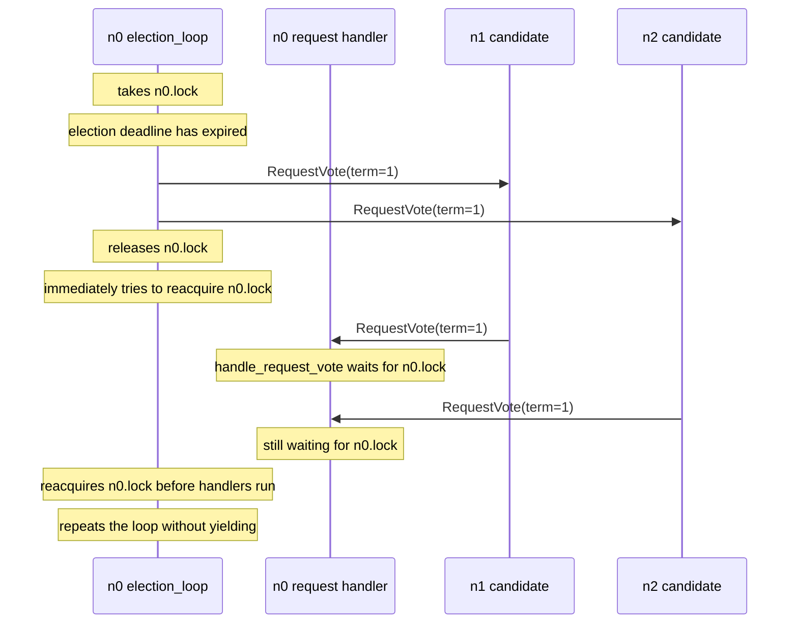
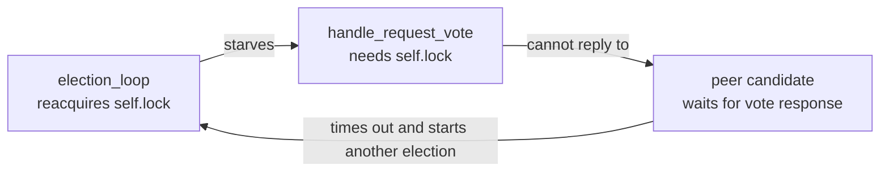

# Lock Starvation from a Tight Election Loop

## Description

The bug is turning the election background thread into a tight loop that
releases `self.lock` and immediately tries to take it again:

```python
def election_loop(self):
    while True:
        with self.lock:
            if (
                datetime.now() > self.election_deadline
                and self.state != State.LEADER
            ):
                self.trigger_election()
```

The canonical loop sleeps after the `with self.lock` block:

```python
def election_loop(self):
    while True:
        with self.lock:
            if (
                datetime.now() > self.election_deadline
                and self.state != State.LEADER
            ):
                self.trigger_election()
        time.sleep(ELECTION_TICK_S)
```

That sleep is outside the lock on purpose. It yields the CPU between election
checks, giving message-handler threads a chance to acquire the same node lock.

Without the sleep, `election_loop` can win the lock again and again between
iterations. The lock is technically released, but in practice handlers such as
`handle_request_vote`, `handle_append_entries`, and `handle_request_vote_ok`
may wait behind the background loop long enough for the node to stop making
Raft progress.

## Example

Three-node cluster: `n0, n1, n2`. There is no leader yet, and each node's
election loop is spinning without `time.sleep(ELECTION_TICK_S)`.



The stalled dependency is local to each node:



Randomized election deadlines do not solve this bug. Once a node's election
thread is spinning, incoming vote and heartbeat messages still need the same
lock to reset the deadline, grant votes, step down, or accept a leader. If
those handlers cannot run promptly, candidates keep timing out and starting new
terms instead of converging on a leader.

## Implementation Note

Background loops that hold a shared node lock should do short local work, leave
the critical section, and then wait outside the lock. The wait can be a sleep,
an event wait, or another blocking primitive, but it must happen after releasing
`self.lock`.

For this election loop, the correct yield is `time.sleep(ELECTION_TICK_S)`
outside the `with self.lock` block. Moving the sleep inside the critical
section would avoid the tight CPU loop but would still block message handlers
while the node is sleeping, so it is a different lock-liveness bug rather than
a fix.
