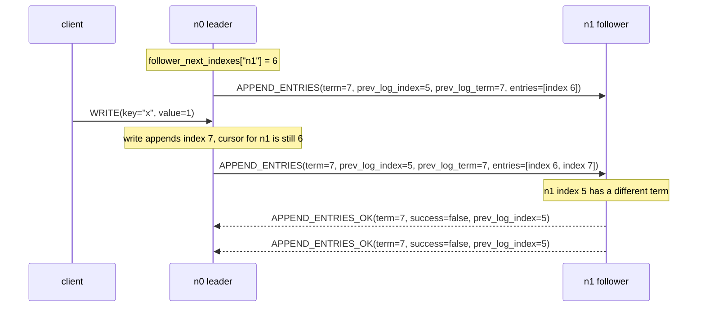

# Concurrent Replication Double Decrement

## Description

The buggy implementation treated every failed `MessageType.APPEND_ENTRIES_OK`
reply as an independent instruction to move `follower_next_indexes[src]` back by
one:

```python
if body["success"] is True:
    self.follower_match_indexes[src] = max(
        body["match_index"], self.follower_match_indexes[src]
    )
    self.follower_next_indexes[src] = max(
        body["match_index"] + 1,
        self.follower_next_indexes[src],
    )
else:
    self.follower_next_indexes[src] = self.follower_next_indexes[src] - 1
```

That backoff logic (i.e. the `else` clause in the code block above) looks like the Raft log-repair rule from section 5.3: if a
follower rejects a `MessageType.APPEND_ENTRIES` probe for some
`prev_log_index`, retry one slot earlier. The missing constraint is that the
leader may have more than one outstanding probe to the same follower for the
same `prev_log_index`.

`replicate_if_applicable` builds each request from the current
`follower_next_indexes[neighbor]`:

```python
follower_next_index = self.follower_next_indexes[neighbor]
prev_log_index = follower_next_index - 1
payload = {
    "type": MessageType.APPEND_ENTRIES,
    "term": self.term,
    "leader_id": self.node_id,
    "prev_log_term": self.record.at(prev_log_index)["term"],
    "prev_log_index": prev_log_index,
    "entries": self.record.slice_from(follower_next_index),
    "leader_commit": self.commit_index,
}
```

If replication is triggered twice before the first reply returns, both requests
can describe the same `prev_log_index`. A matching follower accepts both, and
the success path is harmless because it uses `max(...)`. A follower with a
conflicting log rejects both. The buggy failure path decrements once per reply,
so one real mismatch becomes two or more decrements of
`follower_next_indexes[src]`.

After enough duplicate failures, the cursor can fall below zero. The next call to `replicate_if_applicable` computes a negative
`prev_log_index`, and `Record.at(prev_log_index)` raises
`IndexError("Negative index ... is illegal")`.

The canonical implementation prevents the overcount by making failed replies
self-describing. A follower rejects `MessageType.APPEND_ENTRIES` with the
request's `prev_log_index`, and the leader clamps the cursor to that probed
index:

```python
else:
    self.follower_next_indexes[src] = min(
        self.follower_next_indexes[src],
        body["prev_log_index"],
    )
```

Two failures for the same `prev_log_index` now have the same effect as one
failure. The first reply can move `follower_next_indexes[src]` from `k` to
`k - 1`; the duplicate reply leaves it at `k - 1`.

## Example

Consider a three-node cluster with leader `n0` and follower `n1`. `n0` is in
term 7, has entries through index 6, and has
`follower_next_indexes["n1"] == 6`. `n1` has a divergent entry at index 5, so it
agrees with `n0` through index 4 but will reject any probe whose
`prev_log_index` is 5 and whose `prev_log_term` is 7.

The failure requires no exotic message type. It only requires two replication
passes to run before the first rejection is processed. That can happen when the
periodic `replication_loop` sends a probe, then a client `MessageType.WRITE`
arrives and wakes the same loop with `self.replication_signal.set()` while the
first `MessageType.APPEND_ENTRIES_OK` reply is still in flight.



With the buggy decrement-only handler, the leader processes the two failures as
two separate pieces of evidence:

1. First failed reply: `follower_next_indexes["n1"]` moves from 6 to 5.
2. Second failed reply: `follower_next_indexes["n1"]` moves from 5 to 4.

Only one fact was learned: `n1` does not match `n0` at `prev_log_index == 5`.
The second decrement is not justified because it came from a duplicate probe of
the same index.

The next replication pass probes `prev_log_index == 3` instead of
`prev_log_index == 4`. That overshoot may still repair the log eventually, but
under partitions and leader churn the pattern repeats. Each duplicate rejection
pushes the cursor back another slot without new information. Once the cursor
reaches 0, `replicate_if_applicable` computes `prev_log_index == -1` and
`Record.at(-1)` raises.

With the canonical handler, both failed replies carry `prev_log_index == 5`:

1. First failed reply: `min(6, 5)` moves `follower_next_indexes["n1"]` to 5.
2. Second failed reply: `min(5, 5)` leaves `follower_next_indexes["n1"]` at 5.

The leader backs up exactly once for the failed probe.

## Additional Issues

This bug is usually invisible without partitions. In a healthy cluster with no
recent leader change, duplicate `MessageType.APPEND_ENTRIES` probes tend to
succeed because the follower already agrees at `prev_log_index`. The success
path updates `follower_match_indexes[src]` and `follower_next_indexes[src]`
with `max(...)`, so duplicate successes are idempotent.

Maelstrom's partition nemesis makes the bad interleaving common enough to
observe. Partitions create leader churn, leader churn creates conflicting log
tails, and delayed replies widen the window in which more than one
`MessageType.APPEND_ENTRIES` request can be outstanding for the same follower
cursor. A reproduction target is:

```bash
maelstrom test -w lin-kv --bin './main.py --version v0' \
  --time-limit 60 --node-count 3 --concurrency 4n --rate 30 \
  --nemesis partition
```

## Implementation Note

The safe mental model is that `follower_next_indexes[src]` is a cursor derived
from specific probes, not a counter of failed replies. A non-idempotent failure
handler must know which request failed.

There are two common ways to enforce that rule:

1. Allow only one in-flight `MessageType.APPEND_ENTRIES` probe per follower.
2. Include enough request context in `MessageType.APPEND_ENTRIES_OK` for the
   leader to make duplicate replies idempotent.

The canonical code uses the second approach for failed replies:

- `handle_append_entries` includes `prev_log_index` when it sends
  `success=False`.
- `AppendEntriesOkFailBody` requires `prev_log_index`.
- `handle_append_entries_ok` applies `min(self.follower_next_indexes[src],
  body["prev_log_index"])` instead of decrementing the current cursor.

This keeps prompt replication intact: `handle_write` and `become_leader` can
still wake `replication_loop` through `self.replication_signal.set()`. Duplicate
probes are allowed, but duplicate failures for the same `prev_log_index` no
longer double-count the same mismatch.
