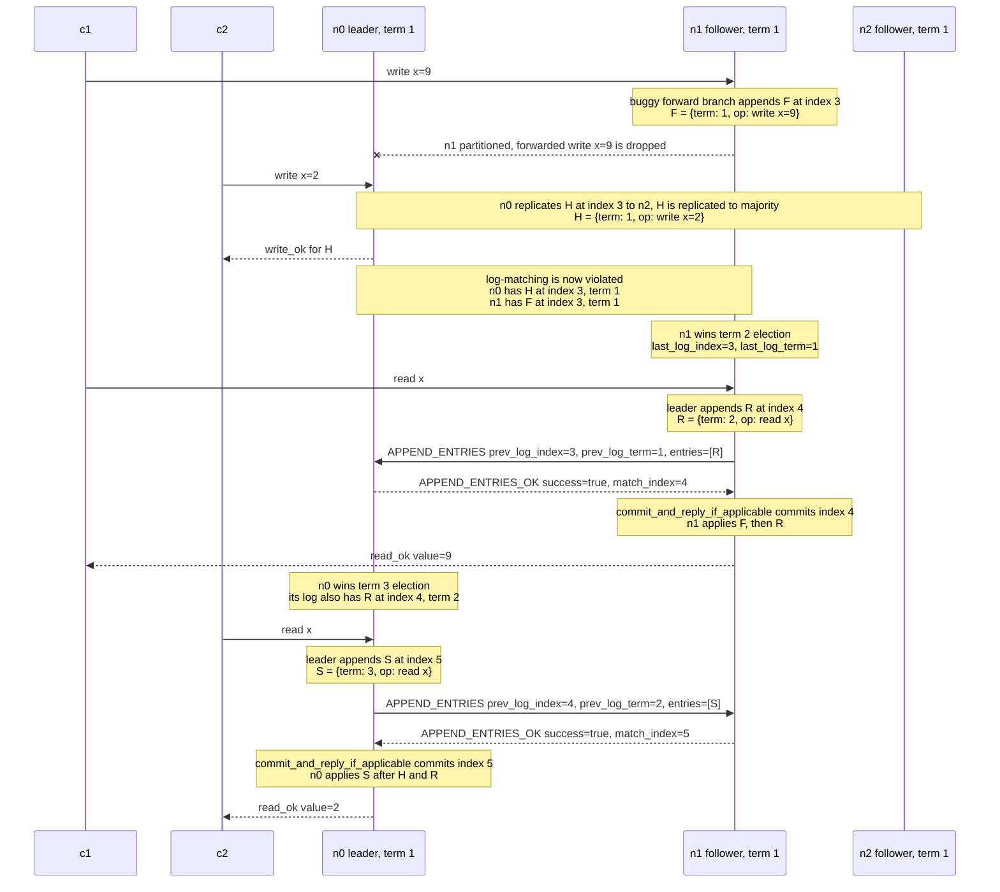

# Followers Locally Append Forwarded Client Requests

## Description

The bug is letting a follower append a client operation to its own `record`
before forwarding the original client message to the known leader. In the
canonical implementation, only the leader appends in
`try_persist_or_forward_entry`:

```python
def try_persist_or_forward_entry(self, entry: LogEntry, message: Message[Any]):
    if self.state == State.LEADER:
        self.record.append(entry)
        self.pending_replies[self.record.last_index()] = message
        self.replication_signal.set()
    elif self.leader is not None:
        self.forward(self.leader, message)
    else:
        self.send(
            message["src"],
            {
                "type": MessageType.ERROR,
                "code": ErrorCode.TEMPORARILY_UNAVAILABLE,
                "in_reply_to": reply_id(message),
                "text": "No leader elected",
            },
        )
```

The buggy version changes the forwarding branch into:

```python
elif self.leader is not None:
    self.record.append(entry)  # BUG: follower forges a local log entry
    self.forward(self.leader, message)
```

That local append looks like a harmless latency optimization: the leader will
probably replicate the same request back to the follower later, so the follower
appears to be doing the work early. It is not harmless. A Raft follower may
change its log only when it handles an `APPEND_ENTRIES` message whose
`prev_log_index`, `prev_log_term`, `entries`, and `leader_commit` fields come
from the current leader. Appending in the forward path bypasses that handshake
and creates a log entry that no leader placed there.

The forged entry is dangerous because the client handlers build it with
`term: self.term`. Once appended, it raises `record.last_index()` and may also
raise or preserve `record.last_term()`. Those are exactly the values advertised
as `last_log_index` and `last_log_term` in a later `REQUEST_VOTE`. A follower
that only forwarded a client request can therefore make itself look more
up-to-date than nodes whose logs contain only leader-issued entries.

## Example

Start with three nodes: `n0`, `n1`, and `n2`. `n0` is leader in term 1.
All nodes have the same committed log:

```text
index: 1  2
log:   A  B
term:  1  1
```

The following execution shows a direct violation of Raft's log-matching
property. During the partition, messages between `n0` and `n1` are delayed or
dropped, but `n0` and `n2` can still communicate and form a majority.



The violation happens before the election for term 2:

```text
n0: [A, B, H]   H = {term: 1, op: write x=2}
n1: [A, B, F]   F = {term: 1, op: write x=9}
n2: [A, B, H]   H = {term: 1, op: write x=2}
```

Because reads are implemented as log entries, the bad prefix can affect reads even
when the read entries themselves are leader-owned and replicated normally. `c1`
reads from `n1` after `R` commits and gets `9`, because `n1` applies `R` after
`F`. Later, `c2` reads from `n0` after `S` commits and gets `2`, because `n0`
applies `S` after `H`. The two reads disagree about the state produced by the
index-3, term-1 log position: `n1` has that position as `F`, while `n0`
has it as `H`.

## Implementation Note

Keep the producer/consumer split strict: the leader produces log entries, and
followers consume them through `handle_append_entries`. For
`try_persist_or_forward_entry`, that means:

- `State.LEADER` appends to `record`, stores the original client `message` in
  `pending_replies`, and wakes replication.
- A follower with `self.leader is not None` only calls
  `forward(self.leader, message)`.
- A node without a known leader returns `MessageType.ERROR` with
  `ErrorCode.TEMPORARILY_UNAVAILABLE`.

Do not compensate by adding follower-side `pending_replies` state. A follower
has no authority to commit the entry and no reliable event that can make a
locally queued client request safe to answer. The original client `src` and
`msg_id` already survive `forward`, so the leader can append the operation at
the leader's next index and reply when the committed entry is applied.
