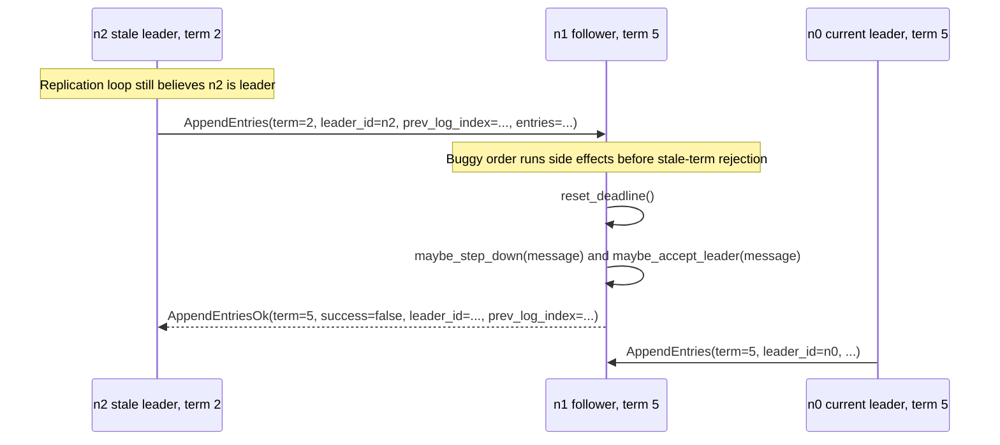

# Reject First, Update State Second

## Description

`handle_append_entries` must reject a stale-term `AppendEntries` before it
updates any local state. The canonical handler does that by checking
`incoming_term < self.term` immediately after reading the message term:

```python
incoming_term = message["body"]["term"]

if incoming_term < self.term:
    self.send(
        message["src"],
        {
            "type": MessageType.APPEND_ENTRIES_OK,
            "in_reply_to": reply_id(message),
            "term": self.term,
            "success": False,
            "leader_id": self.leader,
            "prev_log_index": message["body"]["prev_log_index"],
        },
    )
    return

self.reset_deadline()
self.maybe_step_down(message)
self.maybe_accept_leader(message)
```

The bug moves the state updates above the stale-term check:

```python
incoming_term = message["body"]["term"]

self.reset_deadline()
self.maybe_step_down(message)
self.maybe_accept_leader(message)

if incoming_term < self.term:
    self.send(...)
    return
```

That order is wrong because a stale `AppendEntries` is not evidence that the
cluster has a live current leader. A delayed message such as
`AppendEntries{term=2, leader_id="n1", ...}` arriving at a node whose
`self.term` is already 5 should be rejected by sending
`MessageType.APPEND_ENTRIES_OK` with `success=False`; it should not reset
`self.election_deadline`.

`reset_deadline()` is a side effect of accepting a non-stale leader message. If
it runs before the term guard, an obsolete leader can still act as a false
liveness signal. `maybe_step_down(message)` and `maybe_accept_leader(message)`
are also acceptance-path bookkeeping and belong after the same guard. In the
canonical code, those helpers do not change state for a lower-term
`AppendEntries`. `maybe_step_down()` only reacts to higher terms or same-term
candidate step-downs, and `maybe_accept_leader()` requires
`message["body"]["term"] >= self.term`. Keeping all three calls below the
stale-term check makes that invariant explicit at the handler boundary.

The key rule is the one Raft applies to every RPC term: inspect the term first,
then mutate state only for a message that belongs to the current or a newer
term.

## Example

Three-node cluster: current leader `n0` is in term 5. Follower `n1` also has
`self.term == 5` and `self.leader == "n0"`. Node `n2` was isolated long enough
that it still believes it is leader in term 2.



With the buggy order, `n1` processes the stale `AppendEntries` like this:

1. `reset_deadline()` sets `self.election_deadline` to a fresh election
   timeout even though `n2` is not a valid leader for term 5.
2. `maybe_step_down(message)` and `maybe_accept_leader(message)` happen to
   leave the canonical state unchanged for this lower-term message, but they
   still ran before the handler established that the message was acceptable.
3. The handler finally observes `incoming_term < self.term`, sends a failed
   `AppendEntriesOk`, and returns.

The reply is correct, but the deadline side effect already happened. If `n0` is
actually down or partitioned away, repeated stale heartbeats from `n2` can keep
pushing `n1`'s election deadline into the future, delaying or preventing a new
election. `n1` keeps treating old-term traffic as proof that it recently heard
from a viable leader.

The canonical ordering avoids both outcomes. `n1` rejects the term-2
`AppendEntries` before `reset_deadline()`, `maybe_step_down(message)`, or
`maybe_accept_leader(message)` can run. A stale message may produce a
`success=False` reply, but it cannot refresh liveness state.

## Additional Issues

This bug is quiet in a healthy network because every `AppendEntries` usually
comes from the current leader's term. It becomes visible under partition and
delay scenarios:

- **Partition healing.** A formerly isolated leader can send a burst of
  old-term `AppendEntries` before it learns the cluster has advanced.
- **Delayed in-flight messages.** `AppendEntries` sent before a leader steps
  down can arrive after followers have already moved to a higher term.
- **Repeated stale heartbeats.** If stale heartbeats keep arriving, the faulty
  election deadline reset turns them into a false signal that a current leader
  is alive.

These executions are exactly the kind of timing Maelstrom's partition nemesis
creates. The resulting symptom is usually temporary unavailability caused by
delayed elections. The bug does not need to corrupt the log to violate the
service contract; failing to elect a current leader is enough for the workload
to stop making progress.

A related, more severe failure appears if the leader-id acceptance path is also
weakened. If `maybe_accept_leader(message)` or equivalent logic trusts
`leader_id` without checking the message term, the same bad ordering can set
`self.leader` to an obsolete node. Then a follower can forward client `read`,
`write`, or `cas` requests to that stale `leader_id` through
`try_persist_or_forward_entry()`. The current canonical helper contains its own
term guard, so this leader-redirection symptom is a related implementation
risk, not the minimal ordering bug by itself.

## Implementation Note

Keep the handler split into two phases:

1. **Validate the term.** For `AppendEntries`, if `incoming_term < self.term`,
   send `MessageType.APPEND_ENTRIES_OK` with `success=False`, the receiver's
   current `term`, the receiver's current `leader_id` value from `self.leader`,
   and the request's `prev_log_index`, then return.
2. **Process an acceptable message.** Only after the stale-term return is ruled
   out should the handler call `reset_deadline()`, `maybe_step_down(message)`,
   `maybe_accept_leader(message)`, check `prev_log_index` and `prev_log_term`,
   apply `entries`, advance from `leader_commit`, and send the final
   `AppendEntriesOk`.

The mechanical test is simple: if a line changes `self.election_deadline`,
`self.state`, `self.term`, `self.voted_for`, `self.votes`, `self.leader`, the
log, or `self.commit_index`, it belongs after the stale-term guard unless that
line is part of the guard's failure reply.
