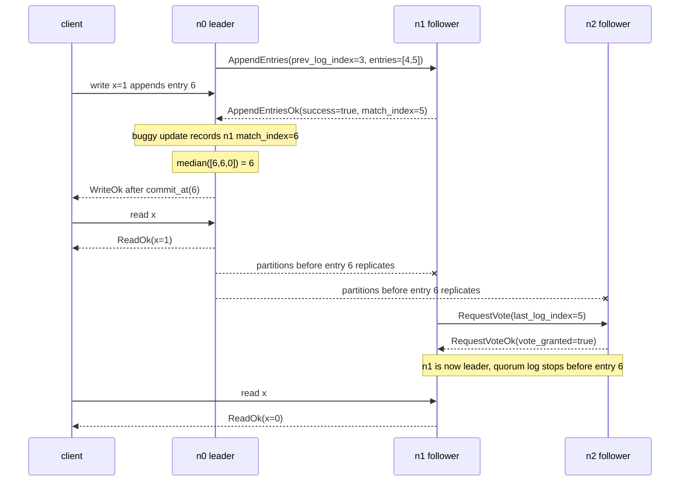

# Match Index Must Come From The Acked Range

## Description

This bug is an unsafe update in `handle_append_entries_ok`.
After receiving a successful `AppendEntriesOk`, the buggy leader records that
the follower has the leader's current log tail:

```python
if body["success"] is True:
    self.follower_match_indexes[src] = self.record.last_index()
    self.follower_next_indexes[src] = self.record.next_index()
```

That treats the reply as evidence about `self.record` at receive time. A
successful `AppendEntriesOk` only acknowledges the `entries` range carried by
the specific `AppendEntries` request that produced the reply. The leader may
have appended more log entries after sending that request and before handling
the reply, so `self.record.last_index()` can be ahead of anything the follower
has accepted.

The canonical implementation makes the acknowledged range explicit. The leader
sends:

```python
payload: AppendEntriesBody = {
    "type": MessageType.APPEND_ENTRIES,
    "term": self.term,
    "leader_id": self.node_id,
    "prev_log_term": prev_entry["term"],
    "prev_log_index": prev_log_index,
    "entries": self.record.slice_from(follower_next_index),
    "leader_commit": self.commit_index,
}
```

On success, the follower replies with the last index covered by that request:

```python
self.send(
    message["src"],
    {
        "type": MessageType.APPEND_ENTRIES_OK,
        "in_reply_to": reply_id(message),
        "term": self.term,
        "success": True,
        "match_index": prev_log_index + len(entries),
    },
)
```

The leader must update replication progress from that `match_index`, not from
its current local tail:

```python
if body["success"] is True:
    self.follower_match_indexes[src] = max(
        body["match_index"], self.follower_match_indexes[src]
    )
    self.follower_next_indexes[src] = max(
        body["match_index"] + 1,
        self.follower_next_indexes[src],
    )
```

The `max(...)` calls also preserve monotonicity when older successful replies
arrive after newer ones.

## Example



Suppose we have three nodes: `n0`, `n1`, and `n2`. `n0` is leader in the
current term. All nodes have entries through index 3, and `n0` has already sent
an `AppendEntries` to `n1` for entries 4 and 5:

```python
n0.record.last_index() == 5
n0.follower_next_indexes["n1"] == 4
```

The in-flight request to `n1` has this logical range:

```python
AppendEntries {
    prev_log_index: 3,
    entries: [entry_4, entry_5],
}
```

Before `n1`'s reply reaches `n0`, a client write arrives at the leader. Suppose
it writes `x = 1`, and the previous committed value of `x` was `0`. The leader
appends entry 6:

```python
n0.record.last_index() == 6
```

`n1` then handles the older `AppendEntries`, accepts only entries 4 and 5, and
replies successfully:

```python
AppendEntriesOk {
    success: True,
    match_index: 5,
}
```

With the buggy update, `n0` ignores the acknowledged range and records its
current tail instead:

```python
n0.follower_match_indexes["n1"] = n0.record.last_index()  # 6
n0.follower_next_indexes["n1"] = n0.record.next_index()   # 7
```

Now `n0` believes `n1` has entry 6, but `n1` only has entries through index 5.
That false progress can immediately advance the commit index. In a three-node
cluster, the commit candidate is the median of the leader's own
`record.last_index()` and the follower `match_index` values:

```python
median([n0.record.last_index(), *n0.follower_match_indexes.values()])
```

If `n2` is still behind, the buggy state can still produce a candidate of 6:

```python
n0.record.last_index() == 6
n0.follower_match_indexes == {"n1": 6, "n2": 0}
median([6, 6, 0]) == 6
```

If entry 6 is from `n0.term`, `commit_and_reply_if_applicable` passes the
current-term guard and calls `commit_at(6, send_reply=True)`. The leader applies
entry 6 and can reply `WriteOk`, `ReadOk`, or `CasOk` to the waiting client even
though no follower actually stores entry 6.

The safety break becomes visible if `n0` is partitioned away before a later
replication sends entry 6 to either follower. `n1` and `n2` can elect a leader
whose log stops before entry 6. The client has already observed `WriteOk` for
`x = 1`, and may also have observed a `ReadOk` returning `x = 1` from `n0`.
After the election, the same client can read from the new leader and observe the
older value `x = 0`. That history cannot be linearized because the successful
write disappeared after it had already been observed.

This does not fail on every run because a later replication round may send
entry 6 to `n1` before leadership changes. The mistaken `match_index` is then
made true after the fact. Maelstrom's partition nemesis widens the vulnerable
window by delaying messages, triggering leader churn, and cutting off the
catch-up replication that would otherwise hide the bug.

## Implementation Note

Do not derive follower progress from the leader's current log in an
`AppendEntriesOk` handler. The progress value must come from the request/reply
pair:

- The leader can stamp the request and remember `prev_log_index + len(entries)`
  for the corresponding `in_reply_to`.
- The follower can echo the accepted range back, as the canonical code does
  with `match_index = prev_log_index + len(entries)`.

Either way, update `follower_match_indexes[src]` and
`follower_next_indexes[src]` monotonically:

```python
self.follower_match_indexes[src] = max(
    body["match_index"], self.follower_match_indexes[src]
)
self.follower_next_indexes[src] = max(
    body["match_index"] + 1,
    self.follower_next_indexes[src],
)
```

An `AppendEntriesOk` response is a fact about one completed
`AppendEntries` request. It is not a promise that the follower has whatever
the leader's `record.last_index()` happens to be when the response is finally
processed.
