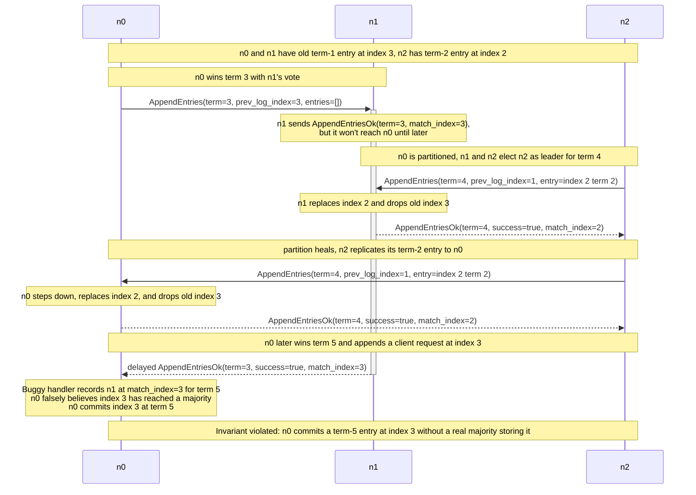

# Stale-Term Acks: Replies From A Previous Leadership Tenure

## Description

`handle_append_entries_ok` must ignore `AppendEntriesOk` replies that were sent
in a different Raft term. A buggy implementation only checks whether the message
forces a step-down and whether the local node is still a leader:

```python
if self.maybe_step_down(message) or self.state != State.LEADER:
    return
```

That looks like a term check, but it only handles one side of the comparison.
`maybe_step_down` demotes the node when `message["body"]["term"] > self.term`.
It deliberately does nothing for `message["body"]["term"] < self.term`: a
lower-term message does not prove that the local node is obsolete. The message
is still obsolete, though, and its body must not update current-term leader
state.

The canonical handler keeps those responsibilities separate:

```python
if (
    self.maybe_step_down(message)
    or self.state != State.LEADER
    or message["body"]["term"] != self.term
):
    return
```

The missing guard lets an old `AppendEntriesOk` from a previous leadership
tenure update `follower_match_indexes` and `follower_next_indexes` after the
same node later becomes leader in a newer term:

```python
if body["success"] is True:
    self.follower_match_indexes[src] = max(
        body["match_index"], self.follower_match_indexes[src]
    )
    self.follower_next_indexes[src] = max(
        body["match_index"] + 1,
        self.follower_next_indexes[src],
    )
else:
    self.follower_next_indexes[src] = min(
        self.follower_next_indexes[src],
        body["prev_log_index"],
    )
```

For a stale successful reply, `body["match_index"]` describes what the follower
accepted in an earlier term, in response to an earlier `AppendEntries` request.
It is not evidence that the follower currently stores that index. Another leader
may have overwritten the follower's log before the reply arrives.

The bug is a reply-side version of Raft's term discipline: every RPC body is
scoped to the `term` it carries. Requests with lower terms are rejected or
ignored; replies whose `term` does not match the local term must be ignored
before their success or failure fields are used.

## Example

Three-node cluster: n0, n1, and n2.

The trace starts with a specific uncommitted-log shape:

- n0 and n1 share an old suffix through index 3, whose last entry is from term
  1.
- n2 has a shorter suffix through index 2, but its last entry is from term 2.

That makes n2's log more up-to-date than n1's for elections, even though it is
shorter. n0 then wins term 3 with n1's vote and sends n1 a heartbeat/probe for
the old suffix. n1 accepts the consistency check and sends a reply:

```python
{
    "type": MessageType.APPEND_ENTRIES_OK,
    "term": 3,
    "success": True,
    "match_index": 3,
}
```

That reply was accurate when n1 sent it: at that moment, n1 had an entry at
index 3 matching n0's log. It is not evidence about what n1 stores after later
terms rewrite the log.



When the delayed reply finally reaches n0, n0 is leader at term 5. In the buggy
handler:

1. `maybe_step_down(message)` returns `False`, because the incoming term 3 is
   lower than `self.term`.
2. `self.state != State.LEADER` is false, because n0 is again a leader.
3. There is no `message["body"]["term"] != self.term` guard.
4. n0 records `follower_match_indexes["n1"] = 3`.

That `match_index` is stale. It was true when n1 sent the term-3 reply, but
n1's log was later rewritten by n2's term-4 `AppendEntries`. n1 does not have
n0's new term-5 entry at index 3.

The false replication record can advance n0's commit calculation:

```python
index = median([self.record.last_index(), *self.follower_match_indexes.values()])
if self.commit_index < index and self.record.at(index)["term"] == self.term:
    self.commit_at(index, send_reply=True)
```

For a three-node cluster, the median includes n0's own `record.last_index()` and
the two follower match indexes. In the trace, only n0 really stores the term-5
entry at index 3. n1 only appears to have acknowledged index 3 because of the
stale term-3 reply. The calculation sees n0 and stale n1 at index 3 and treats
that as a majority. Because `record.at(3)["term"] == self.term`, n0 passes the
current-term commit guard and moves `commit_index` to 3.

That commit is not durable on a real majority. The term-5 entry at index 3 is
stored only on n0; n1's current log does not contain it, and n2 has not
acknowledged it. The violated invariant is the commit-safety property Raft
relies on for linearizability: once a leader commits a log entry, that entry
must be stored on a real majority and present in every future leader's log.

## Implementation Note

Do not fold stale-message filtering into `maybe_step_down`. Step-down and
message validity answer different questions:

- `maybe_step_down` asks whether the local node has discovered a newer term and
  must stop acting as leader or candidate.
- The `message["body"]["term"] != self.term` guard asks whether this reply
  describes the current term.

For replies such as `RequestVoteOk` and `AppendEntriesOk`, the safe rule is:
first step down on a higher term, then ignore the reply unless the node is still
in the expected state and the reply's `term` exactly equals `self.term`.
